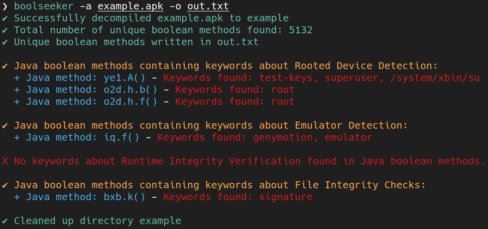
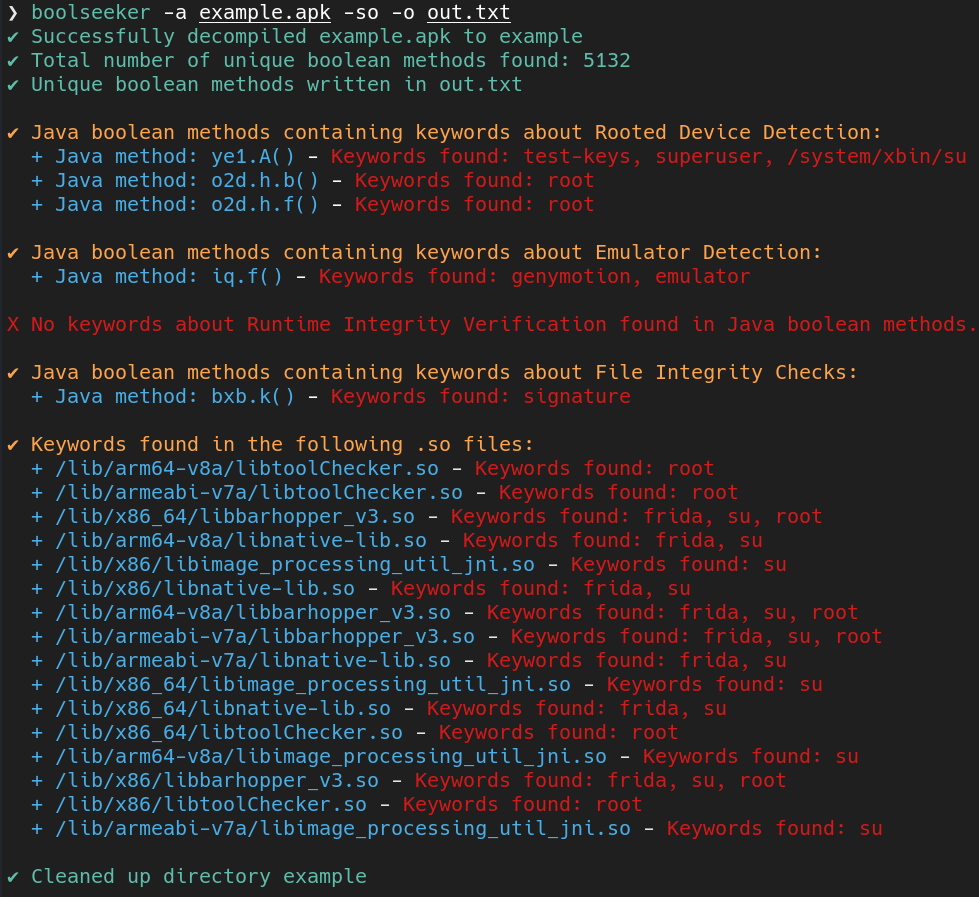

# Boolseeker

Boolseeker is a powerful but simple tool designed to analyze APK files for detection mechanisms related to hardenings, saving time when bypassing basic hardening measures in Android applications. It extracts all boolean Java methods with their full paths and saves them to an output file, while also searching for specific keyword strings within those methods and providing the option to search for keyword strings in shared object (SO) native functions.

More specifically it checks for:
    - Rooted Device Detection;
    - Emulator Detection;
    - Runtime Integrity Verification;
    - File Integrity Checks.

Finally, if the android application method names are not obfuscated, all boolean Java functions are saved in an output file and thus it can be searched with `grep` for suspicious methods related to detections.


## Installation

To install the tool, run:

```bash
go install github.com/0xdeny/boolseeker@latest
```

Note: Please ensure that <a href="https://www.kali.org/tools/apktool/" target="_blank">apktool</a> is installed on your system for Boolseeker to function properly (tested only with this installation source).

## Usage

Use `-h` or `--help` to display the help for the tool:

```bash
boolseeker -h
```

Boolseeker requires an apk file (-a) and an output file (-o) as mandatory parameters. The tool admits the following options:


## Options


```bash
-a, --apk string      Path to the APK file to decode and analyze (required)
-o, --output string   Path to the output file for boolean method names (required)
-so                   Enable searching in .so files
--version             Display the current version of Boolseeker
-h, --help            Display help information
```

## Examples

```bash
boolseeker -a example.apk -o out.txt
```

<details>
  <summary>Output</summary>
  
</details>

```bash
boolseeker -a example.apk -so -o out.txt
```
<details>
  <summary>Output</summary>
  
</details>

## Author

**Symeon Papadimitriou**

<a href="https://www.linkedin.com/in/symeon-papadimitriou/" target="_blank">LinkedIn</a>

## License

`boolseeker` is distributed under MIT License.
